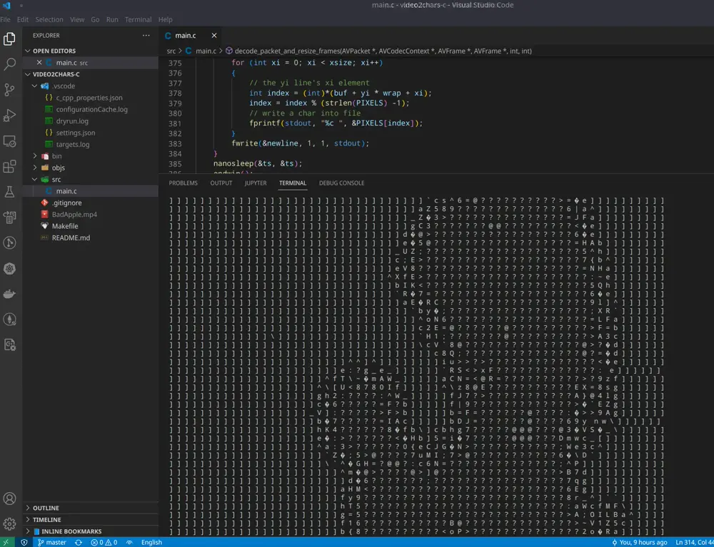

# video2ascii-c

yet another video2ascii in c.

## Dependencies

download `BadApple.mp4` into project root directory first: <https://github.com/ryan4yin/video2chars/raw/master/tests/BadApple.mp4>

then install dependencies, `opensuse` as an example:

```shell
sudo zypper in clang clang-devel pkgconf-pkg-config
sudo zypper in ncurses ncurses-devel
sudo zypper in ffmpeg-5 \
  ffmpeg-5-libavcodec-devel \
  ffmpeg-5-libavutil-devel \
  ffmpeg-5-libswresample-devel \
  ffmpeg-5-libswscale-devel \
  ffmpeg-5-libavformat-devel \
  ffmpeg-5-libavdevice-devel \
  ffmpeg-5-libavfilter-devel

# use mpv to play audio
sudo zypper in mpv
```

## Build and Run

Build and run the program via `clang`:

```shell
make run
```


## Demo




## Related Projects

- [video2chars(Python)](https://github.com/ryan4yin/video2chars)
- [Video2ASCII.jl(Julia)](https://github.com/ryan4yin/Video2ASCII.jl)
- [video2ascii-rs(Rust)](https://github.com/ryan4yin/video2ascii-rs)
- [video2ascii(Go)](https://github.com/ryan4yin/video2ascii)


## Related Documents/Examples

- https://github.com/leandromoreira/ffmpeg-libav-tutorial#ffmpeg-libav-architecture
- https://github.com/FFmpeg/FFmpeg/blob/master/doc/examples/decode_video.c
